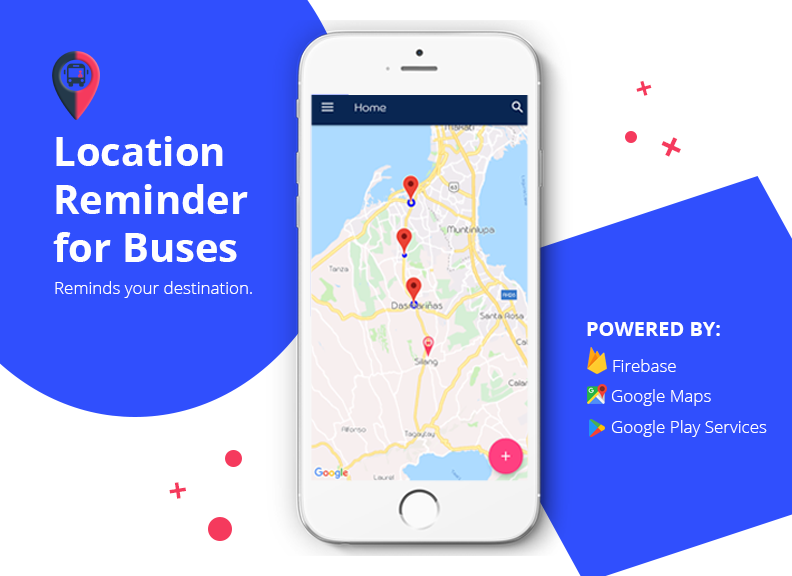

# Location Reminder for Buses (Thesis Project)
The Android-Based Location Reminder for Buses is designed to remind commuters about their destination. 
 
FEATURES: 
-user registration and login for bus drivers and commuters; 
-display current location of the user; 
-ability to set reminder for a particular geographical location; 
-ability to add multiple location-based reminder; 
-scan QR Code to send the desired destination to bus drivers; 
-generate a QR Code for every bus; 
-display list of reminders for bus drivers and commuters; and 
-notification settings. 

